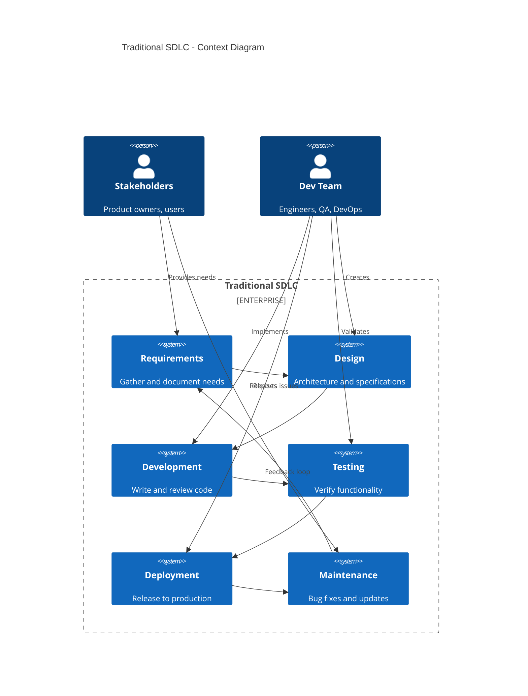
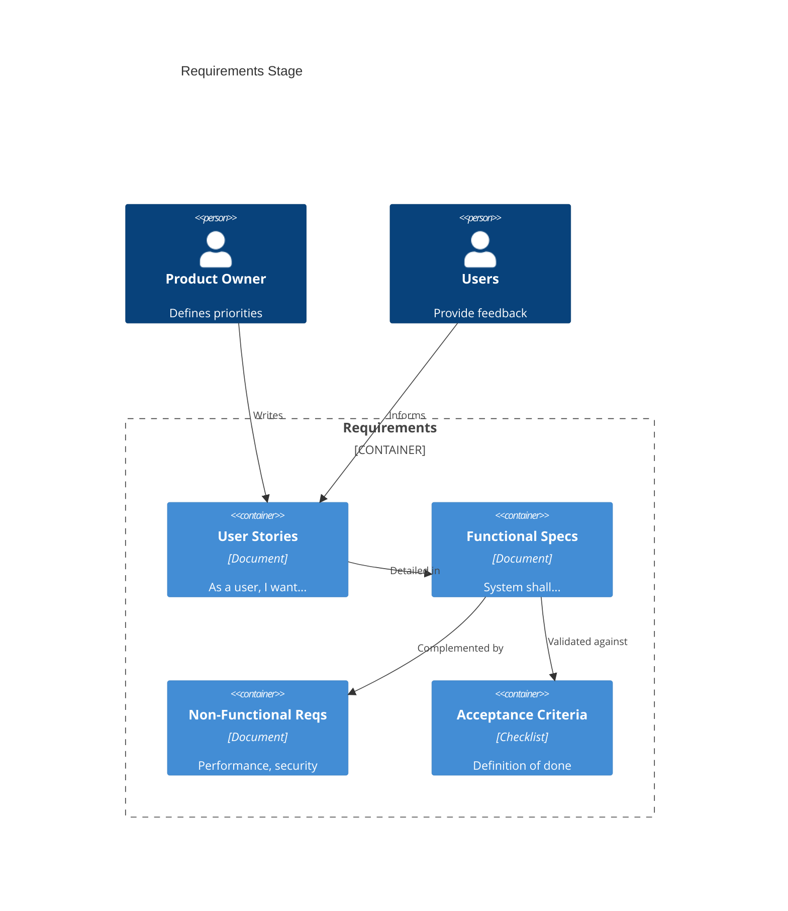
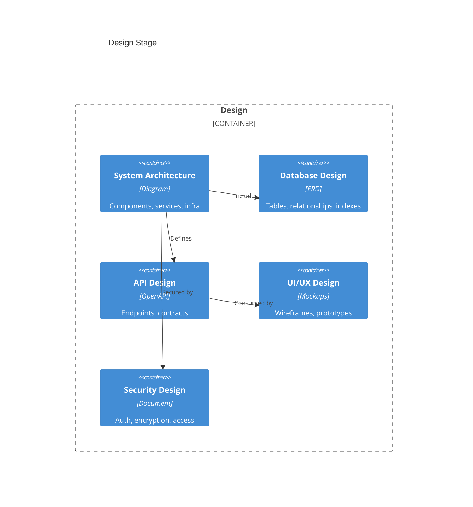
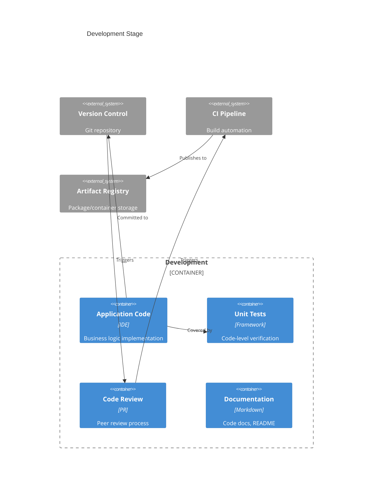
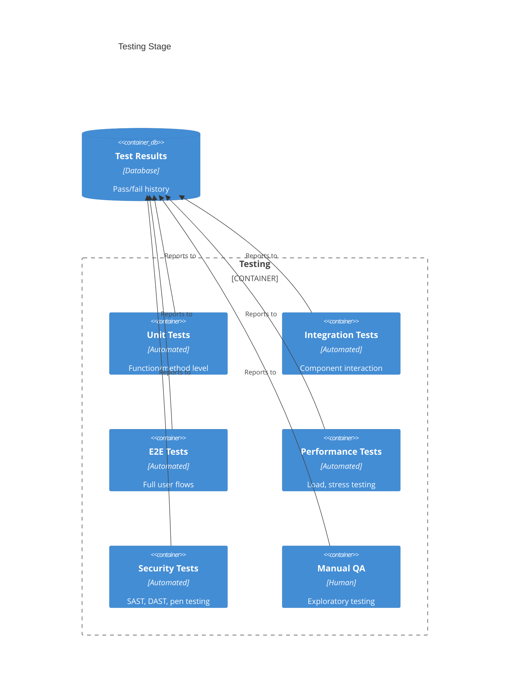
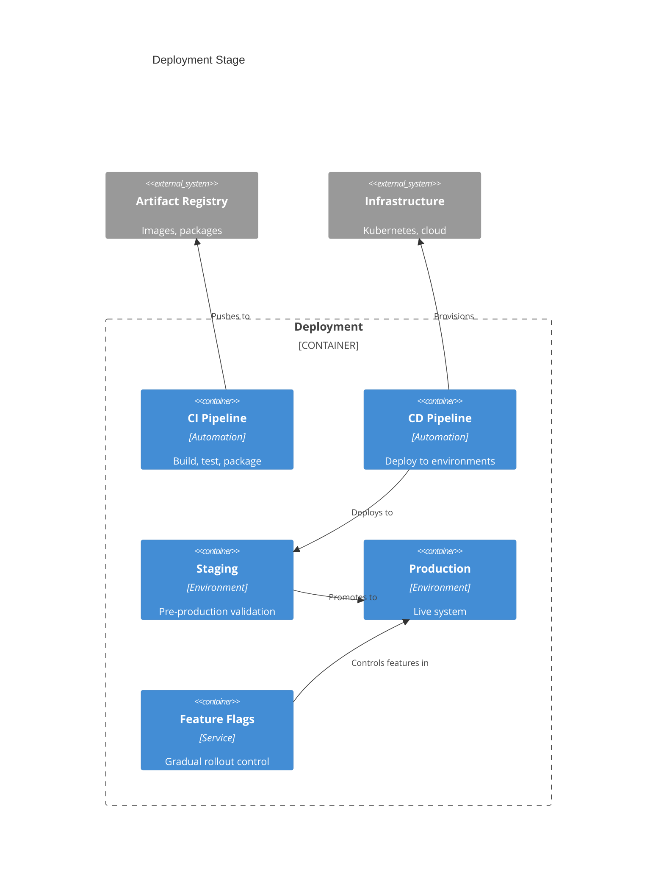
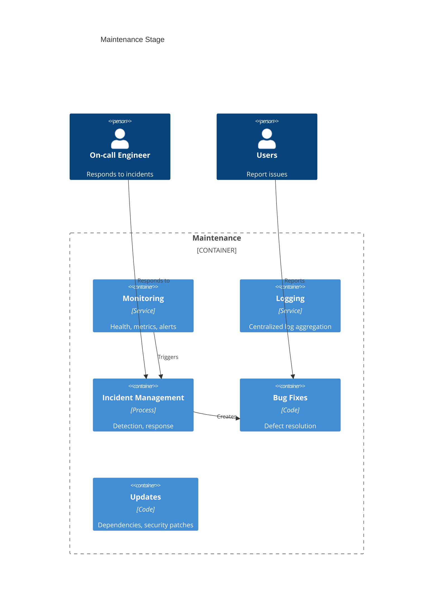

# Traditional Software Development Life Cycle

> The established framework for building software systems, refined over decades.

## Overview



## Stage 1: Requirements

**Purpose**: Understand what to build and why.



### Key Activities
- Stakeholder interviews
- User research
- Competitive analysis
- Requirements documentation
- Prioritization (MoSCoW, RICE)

### Artifacts
- Product Requirements Document (PRD)
- User stories with acceptance criteria
- Use case diagrams
- Non-functional requirements

### Tools
| Category | Tools |
|----------|-------|
| **Project Management** | Jira, Linear, Asana, Azure DevOps |
| **Documentation** | Confluence, Notion, Google Docs |
| **Diagramming** | Miro, FigJam, Lucidchart |
| **Research** | UserTesting, Hotjar, Mixpanel |

---

## Stage 2: Design

**Purpose**: Define how the system will be built.



### Key Activities
- Architecture decision records (ADRs)
- Database schema design
- API contract definition
- UI/UX prototyping
- Security threat modeling
- Technical spike/PoC

### Artifacts
- Architecture diagrams (C4, UML)
- Entity-Relationship Diagrams
- OpenAPI/Swagger specifications
- Wireframes and mockups
- Security design document

### Tools
| Category | Tools |
|----------|-------|
| **Architecture** | Draw.io, Lucidchart, PlantUML, Structurizr |
| **Database** | dbdiagram.io, MySQL Workbench, pgAdmin |
| **API Design** | Swagger/OpenAPI, Postman, Stoplight |
| **UI/UX** | Figma, Sketch, Adobe XD |
| **Security** | OWASP Threat Dragon, Microsoft TMT |

---

## Stage 3: Development

**Purpose**: Build the software according to design.



### Key Activities
- Feature implementation
- Unit test writing
- Code review
- Documentation
- Dependency management
- Local testing

### Artifacts
- Source code
- Unit tests
- Code documentation
- Build configurations
- Container images

### Tools
| Category | Tools |
|----------|-------|
| **IDE** | VS Code, IntelliJ, WebStorm |
| **Version Control** | Git, GitHub, GitLab, Bitbucket |
| **Languages** | TypeScript, Python, Java, Go, Rust |
| **Frameworks** | React, Next.js, Django, Spring, Express |
| **Testing** | Jest, pytest, JUnit, Go testing |
| **Containers** | Docker, Podman |

---

## Stage 4: Testing

**Purpose**: Verify the software works correctly.



### Key Activities
- Test planning
- Test case development
- Automated test execution
- Manual exploratory testing
- Performance benchmarking
- Security scanning
- Bug reporting and tracking

### Artifacts
- Test plans
- Test cases
- Test reports
- Bug reports
- Coverage reports

### Key Metrics
| Metric | Description |
|--------|-------------|
| **Code Coverage** | % of code executed by tests |
| **Pass Rate** | % of tests passing |
| **Defect Density** | Bugs per KLOC |
| **MTTR** | Mean time to resolve bugs |

### Tools
| Category | Tools |
|----------|-------|
| **Unit Testing** | Jest, pytest, JUnit, Go testing |
| **Integration** | Testcontainers, WireMock |
| **E2E** | Cypress, Playwright, Selenium |
| **Performance** | k6, JMeter, Gatling, Locust |
| **Security** | SonarQube, Snyk, OWASP ZAP, Burp Suite |
| **Bug Tracking** | Jira, Linear, GitHub Issues |

---

## Stage 5: Deployment

**Purpose**: Release software to production.



### Key Activities
- Build automation
- Environment configuration
- Release management
- Deployment execution
- Smoke testing
- Rollback procedures

### Deployment Strategies
| Strategy | Description | Use Case |
|----------|-------------|----------|
| **Blue-Green** | Two identical environments | Zero-downtime |
| **Canary** | Gradual traffic shift | Risk mitigation |
| **Rolling** | Incremental instance update | Resource efficient |
| **Feature Flags** | Code deployed, feature toggled | Decouple deploy from release |

### Tools
| Category | Tools |
|----------|-------|
| **CI/CD** | GitHub Actions, GitLab CI, Jenkins, CircleCI |
| **Infrastructure** | Terraform, Pulumi, CloudFormation |
| **Orchestration** | Kubernetes, Docker Swarm, ECS |
| **Feature Flags** | LaunchDarkly, Statsig, Unleash |
| **Secrets** | Vault, AWS Secrets Manager |

---

## Stage 6: Maintenance

**Purpose**: Keep the system running and evolving.



### Key Activities
- Production monitoring
- Incident response
- Bug fixing
- Security patching
- Dependency updates
- Performance optimization
- Technical debt reduction

### Key Metrics
| Metric | Description |
|--------|-------------|
| **Uptime** | System availability % |
| **MTTR** | Mean time to recovery |
| **MTTD** | Mean time to detect |
| **Error Rate** | Errors per request |
| **P99 Latency** | 99th percentile response time |

### Tools
| Category | Tools |
|----------|-------|
| **APM** | Datadog, New Relic, Dynatrace |
| **Logging** | ELK Stack, Splunk, Grafana Loki |
| **Metrics** | Prometheus, Grafana, CloudWatch |
| **Alerting** | PagerDuty, Opsgenie, VictorOps |
| **Incident** | Incident.io, FireHydrant, Rootly |

---

## SDLC Models

### Waterfall
```
Requirements → Design → Development → Testing → Deployment → Maintenance
```
- Sequential, phase-gate approach
- Good for: Well-defined, stable requirements
- Risk: Late feedback, costly changes

### Agile/Scrum
```
Sprint Planning → Development → Testing → Review → Retrospective
                        ↑__________________________|
```
- Iterative, incremental delivery
- Good for: Evolving requirements, fast feedback
- Risk: Scope creep, documentation gaps

### DevOps/CI-CD
```
Code → Build → Test → Release → Deploy → Operate → Monitor
  ↑______________________________________________|
```
- Continuous integration and delivery
- Good for: Rapid releases, automation
- Risk: Complexity, tooling overhead

---

## Summary: Traditional SDLC Characteristics

| Characteristic | Description |
|----------------|-------------|
| **Deterministic** | Same code produces same output |
| **Pass/Fail Testing** | Tests either pass or fail |
| **Code as Artifact** | Source code is the primary deliverable |
| **Stack Trace Debugging** | Errors have clear traces |
| **Infrastructure Costs** | Pay for compute/storage |
| **Security Focus** | Prevent unauthorized access |
| **Bug-Driven Feedback** | Users report issues |

---

**Next**: [AI Agent SDLC →](02-ai-agent-sdlc.md)
