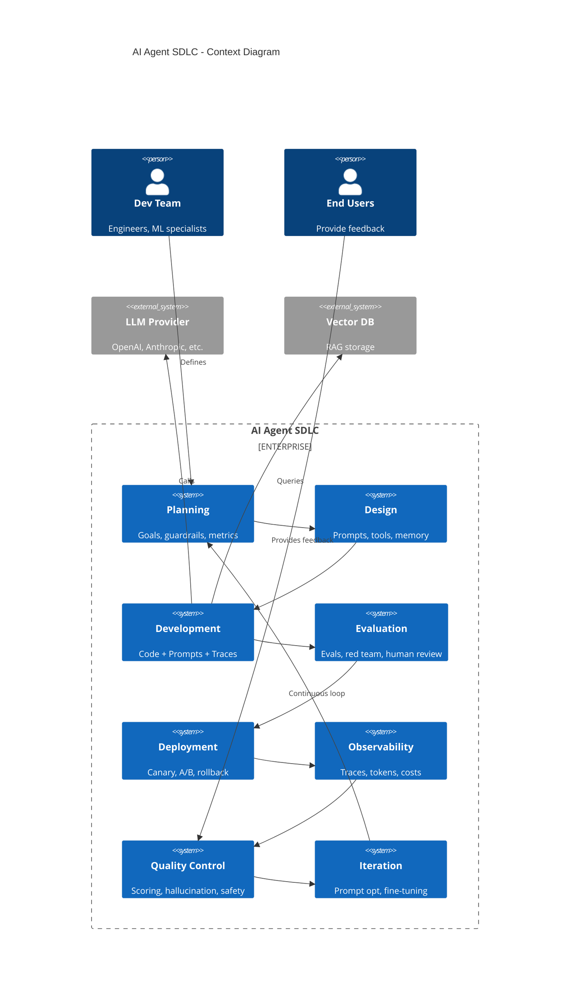
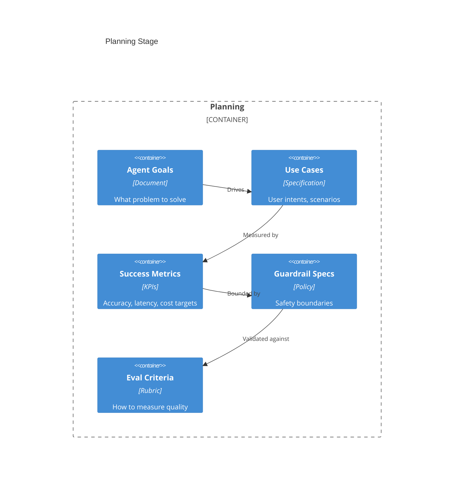
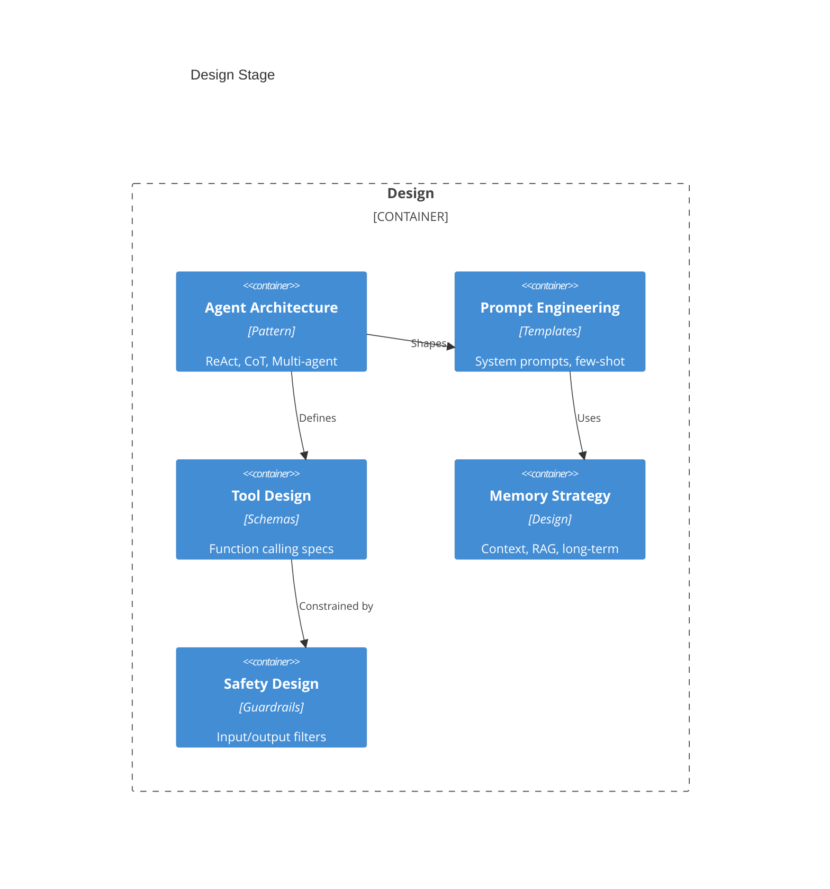
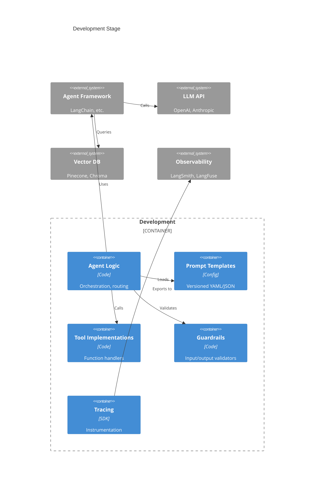
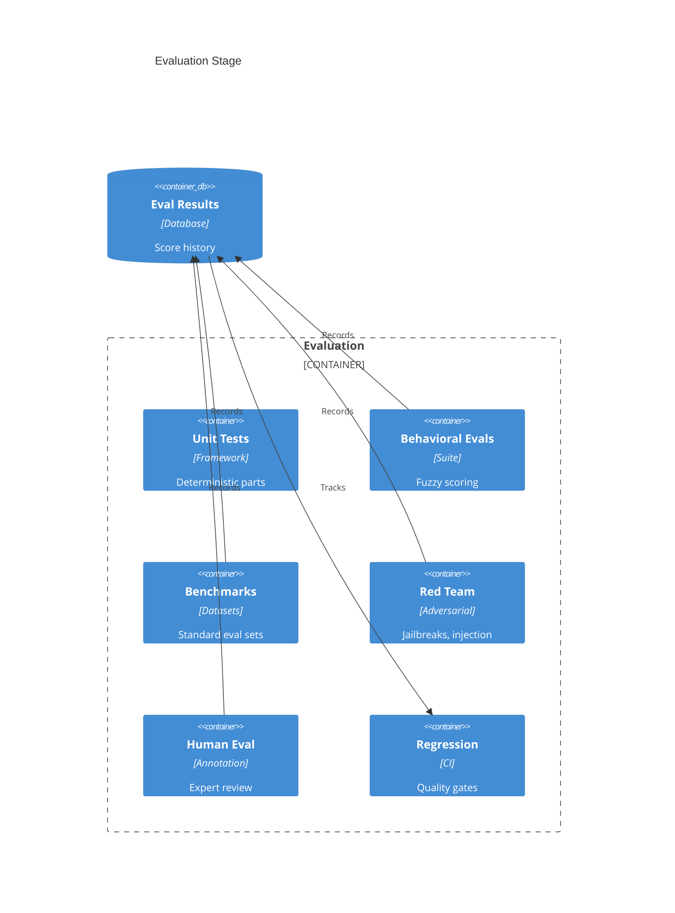
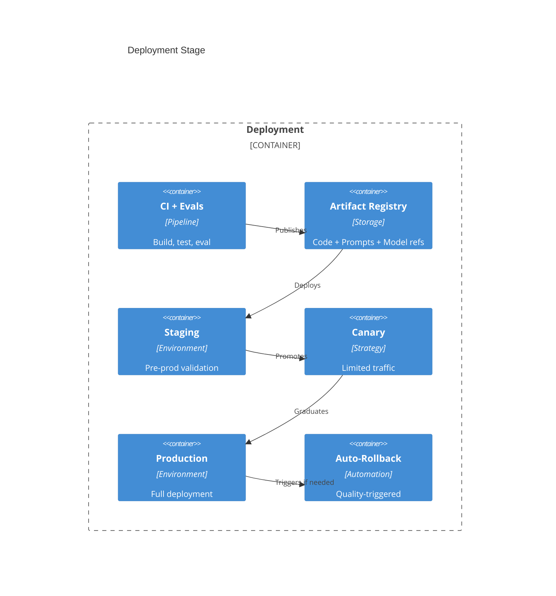
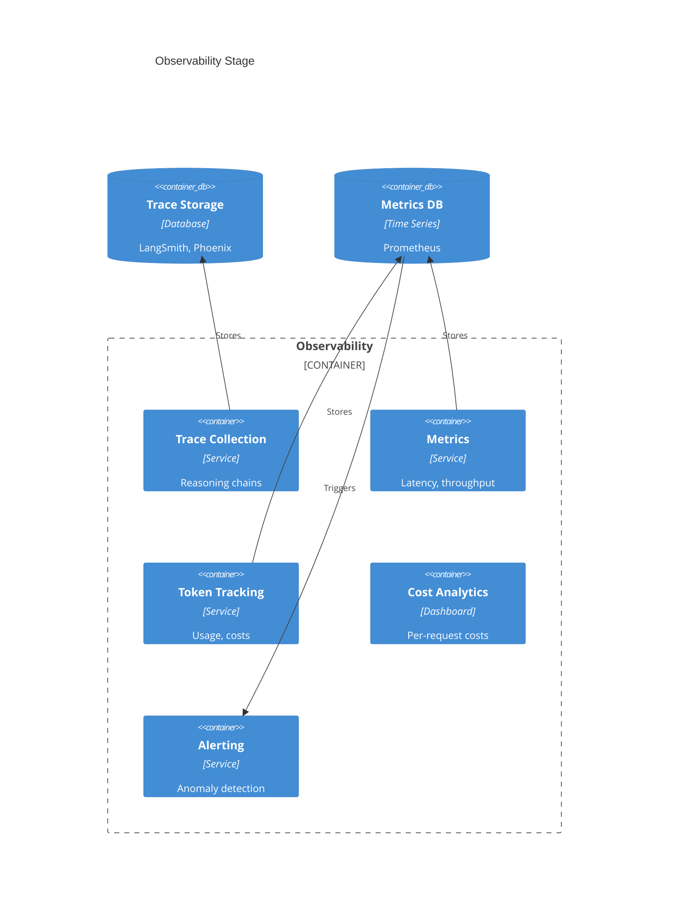
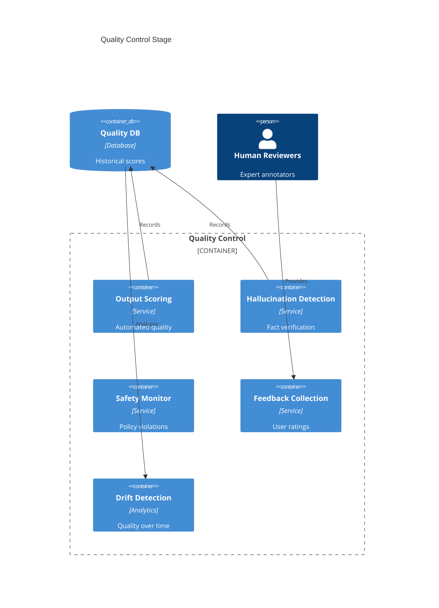
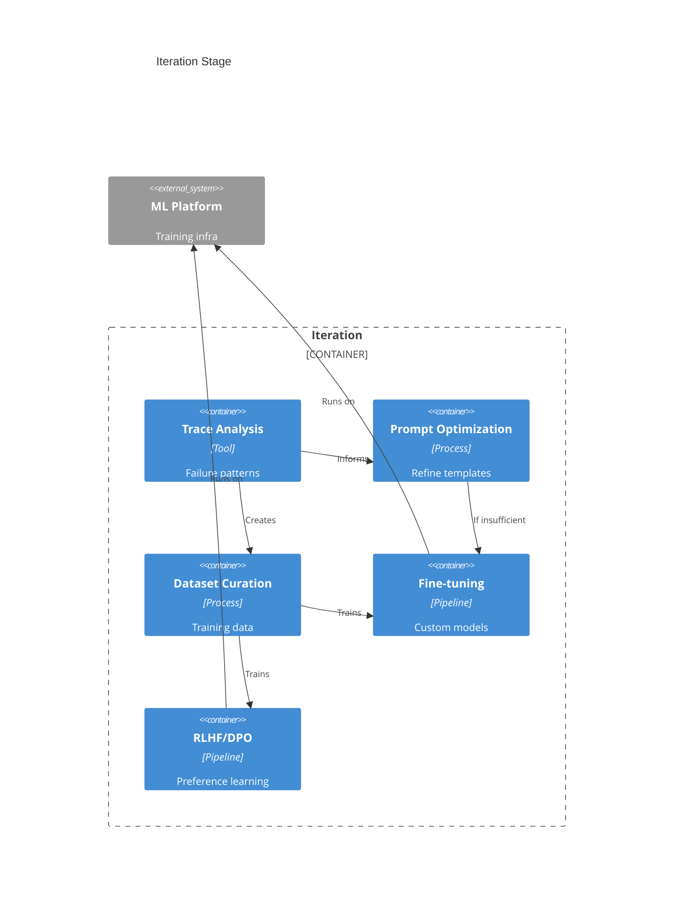

# AI Agent Software Development Life Cycle

> A new paradigm for building AI-powered autonomous systems.

## Overview



## What's Different?

| Aspect | Traditional | AI Agent |
|--------|-------------|----------|
| Output | Deterministic | Probabilistic |
| Artifact | Code | Code + Prompts + Model |
| Testing | Pass/fail | Fuzzy scoring |
| Debugging | Stack traces | Reasoning traces |
| Costs | Compute/storage | Per-token pricing |
| Safety | Security | Security + Alignment |

---

## Stage 1: Planning

**Purpose**: Define what the agent should achieve and its boundaries.



### Key Activities
- Define agent's purpose and scope
- Identify user intents and scenarios
- Set measurable success criteria
- Define safety boundaries and policies
- Design evaluation rubrics
- Set cost and latency budgets

### Artifacts
- Agent specification document
- Use case catalog
- Success metrics and KPIs
- Guardrail policy document
- Evaluation criteria rubric

### Key Questions
- What task should the agent accomplish?
- What are acceptable failure modes?
- What content/actions are prohibited?
- What's the token budget per request?
- How do we measure "good enough"?

### Tools
| Category | Tools |
|----------|-------|
| **Project Management** | Jira, Linear, Notion |
| **Prompt Management** | PromptLayer, Humanloop, Agenta |
| **Eval Design** | Braintrust, Scorecard |

---

## Stage 2: Design

**Purpose**: Architect the agent system and design prompts.



### Agent Patterns

| Pattern | Description | Use Case |
|---------|-------------|----------|
| **ReAct** | Reason + Act loop | Tool-using agents |
| **Chain-of-Thought** | Step-by-step reasoning | Complex reasoning |
| **Plan-and-Execute** | Plan first, then execute | Multi-step tasks |
| **Multi-Agent** | Multiple specialized agents | Complex workflows |
| **Reflexion** | Self-critique and improve | Iterative refinement |

### Key Activities
- Choose agent architecture pattern
- Design system prompts and templates
- Define tool/function schemas
- Design memory and retrieval strategy
- Plan context window management
- Design safety guardrails

### Artifacts
- Architecture decision records
- Prompt templates (versioned)
- Tool/function schemas (JSON Schema)
- Memory architecture diagram
- Guardrail specifications

### Tools
| Category | Tools |
|----------|-------|
| **Frameworks** | LangChain, LlamaIndex, AutoGen, CrewAI |
| **Prompt IDEs** | PromptLayer, Humanloop, Agenta |
| **RAG/Memory** | Pinecone, Weaviate, Chroma, Qdrant |
| **Diagramming** | Miro, Draw.io, Excalidraw |

---

## Stage 3: Development

**Purpose**: Build the agent system with observability.



### Key Activities
- Implement agent orchestration
- Create versioned prompt templates
- Build tool/function implementations
- Implement guardrail validators
- Instrument with tracing
- Handle context window limits
- Implement error handling and retries

### Artifacts
- Agent code (Python/TypeScript)
- Prompt templates (version controlled)
- Tool implementations
- Guardrail configurations
- Tracing instrumentation

### Code Example: Basic Agent Structure
```python
# Pseudo-code structure
class Agent:
    def __init__(self):
        self.llm = LLM(model="gpt-4")
        self.tools = [search_tool, calculator_tool]
        self.memory = VectorStore()
        self.guardrails = Guardrails()
        self.tracer = Tracer()

    @trace
    def run(self, user_input: str) -> str:
        # Validate input
        self.guardrails.validate_input(user_input)

        # Retrieve context
        context = self.memory.search(user_input)

        # Generate response with tools
        response = self.llm.generate(
            system_prompt=SYSTEM_PROMPT,
            user_message=user_input,
            context=context,
            tools=self.tools
        )

        # Validate output
        self.guardrails.validate_output(response)

        return response
```

### Tools
| Category | Tools |
|----------|-------|
| **Frameworks** | LangChain, LlamaIndex, Haystack, AutoGen |
| **LLM APIs** | OpenAI, Anthropic, Google, Cohere, Mistral |
| **Guardrails** | Guardrails AI, NeMo Guardrails, Rebuff |
| **Tracing** | LangSmith, LangFuse, Arize Phoenix, OpenLLMetry |

---

## Stage 4: Evaluation

**Purpose**: Assess agent quality with fuzzy metrics.



### Evaluation Types

| Type | Description | Automation |
|------|-------------|------------|
| **Unit Tests** | Deterministic component tests | Automated |
| **Behavioral Evals** | Input→Output quality scoring | Automated |
| **Benchmark Evals** | Standard datasets (MMLU, etc.) | Automated |
| **LLM-as-Judge** | Use LLM to evaluate outputs | Automated |
| **Red Teaming** | Adversarial testing | Semi-automated |
| **Human Evaluation** | Expert annotation | Manual |

### Scoring Methods

| Method | Description |
|--------|-------------|
| **Exact Match** | Output == expected |
| **Fuzzy Match** | Similarity score |
| **LLM-as-Judge** | LLM rates quality 1-5 |
| **Rubric Scoring** | Multi-criteria rubric |
| **Human Rating** | Expert annotation |

### Key Metrics
| Metric | Description |
|--------|-------------|
| **Task Accuracy** | % correct completions |
| **Hallucination Rate** | % factually incorrect |
| **Safety Violation Rate** | % policy violations |
| **Refusal Rate** | % inappropriate refusals |
| **Latency P50/P99** | Response time distribution |
| **Token Efficiency** | Output quality per token |

### Tools
| Category | Tools |
|----------|-------|
| **Eval Frameworks** | Promptfoo, RAGAS, DeepEval, Evalplus |
| **Benchmarks** | MMLU, HumanEval, MT-Bench, AlpacaEval |
| **Platforms** | Braintrust, LangSmith Evals, Humanloop |
| **Red Teaming** | Garak, promptfoo adversarial |
| **Human Eval** | Scale AI, Surge AI, Labelbox |

---

## Stage 5: Deployment

**Purpose**: Release with quality gates and rollback capability.



### Deployment Differences

| Aspect | Traditional | AI Agent |
|--------|-------------|----------|
| **Artifacts** | Code/containers | + Prompts + Model refs |
| **Quality Gate** | Tests pass | + Eval scores above threshold |
| **Rollback Trigger** | Errors, latency | + Quality degradation |
| **A/B Testing** | Feature comparison | Model/prompt comparison |

### Key Activities
- Version prompts alongside code
- Set eval score thresholds for deployment
- Configure canary deployment
- Set up A/B testing for model variants
- Implement quality-triggered rollback
- Monitor token costs during rollout

### Tools
| Category | Tools |
|----------|-------|
| **LLM Hosting** | AWS Bedrock, Azure OpenAI, Vertex AI |
| **Agent Hosting** | Modal, Replicate, Baseten, Anyscale |
| **Experiment Tracking** | Weights & Biases, MLflow, Comet |
| **Feature Management** | LaunchDarkly, Statsig |

---

## Stage 6: Observability

**Purpose**: Monitor reasoning, costs, and quality in real-time.



### What to Monitor

| Category | Metrics |
|----------|---------|
| **Performance** | Latency (P50, P99), throughput |
| **Tokens** | Input/output counts, cost per request |
| **Quality** | Online eval scores, user ratings |
| **Errors** | LLM errors, tool failures, guardrail blocks |
| **Business** | Task completion rate, user satisfaction |

### Trace Anatomy
```
Request → Input Guardrail → LLM Call 1 → Tool Call → LLM Call 2 → Output Guardrail → Response
   │            │               │            │            │              │              │
   └────────────┴───────────────┴────────────┴────────────┴──────────────┴──────────────┘
                                    Full Trace Span
```

### Tools
| Category | Tools |
|----------|-------|
| **LLM Observability** | LangSmith, LangFuse, Arize Phoenix, Helicone |
| **Cost Tracking** | OpenMeter, Helicone |
| **General APM** | Datadog, New Relic (with LLM integrations) |
| **Dashboards** | Grafana, custom |

---

## Stage 7: Quality Control

**Purpose**: Detect and respond to quality issues.



### Quality Signals

| Signal | Description | Response |
|--------|-------------|----------|
| **Low Quality Score** | Output below threshold | Alert, investigate |
| **Hallucination** | Factually incorrect | Flag, potentially block |
| **Safety Violation** | Policy breach | Block, alert |
| **User Thumbs Down** | Negative feedback | Log, analyze patterns |
| **Quality Drift** | Score degradation over time | Trigger iteration |

### Key Activities
- Real-time output quality scoring
- Hallucination detection and grounding
- Safety violation monitoring
- User feedback collection
- Quality drift detection
- Human review of flagged outputs

### Tools
| Category | Tools |
|----------|-------|
| **Quality Scoring** | Braintrust, RAGAS, custom LLM-as-judge |
| **Hallucination** | Vectara, Chainpoll, grounding checks |
| **Safety** | Guardrails AI, Azure Content Safety, Perspective |
| **Feedback** | Custom UI, Retool |

---

## Stage 8: Iteration

**Purpose**: Continuously improve from feedback and failures.



### Improvement Hierarchy

```
1. Prompt Optimization (fast, cheap)
         ↓ if insufficient
2. Few-shot Examples (medium)
         ↓ if insufficient
3. RAG/Retrieval Improvements (medium)
         ↓ if insufficient
4. Fine-tuning (slow, expensive)
         ↓ if insufficient
5. RLHF/DPO (slowest, most expensive)
```

### Key Activities
- Analyze failure patterns from traces
- Optimize prompts based on failures
- Curate datasets from production data
- Fine-tune models if needed
- Implement RLHF from human feedback
- Evaluate new model versions

### Tools
| Category | Tools |
|----------|-------|
| **Prompt Optimization** | DSPy, TextGrad, OPRO |
| **Fine-tuning** | OpenAI fine-tuning, Together AI, Fireworks |
| **RLHF/DPO** | Hugging Face TRL, OpenRLHF |
| **Dataset Management** | Argilla, Label Studio, Lilac |
| **Experiment Tracking** | Weights & Biases, MLflow |

---

## Summary: AI Agent SDLC Characteristics

| Characteristic | Description |
|----------------|-------------|
| **Probabilistic** | Same input can produce different outputs |
| **Fuzzy Testing** | Quality scores instead of pass/fail |
| **Triple Versioning** | Code + Prompts + Model references |
| **Trace Debugging** | Full reasoning chain visibility |
| **Token Economics** | Per-token cost optimization |
| **Safety + Alignment** | Beyond security to ethical behavior |
| **Continuous Learning** | Human feedback drives improvement |

---

**Next**: [Side-by-Side Comparison →](03-comparison.md)
