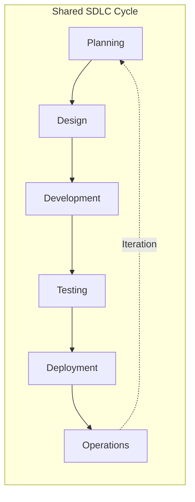
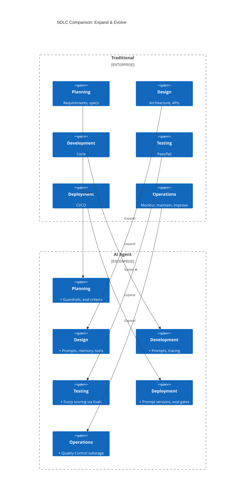
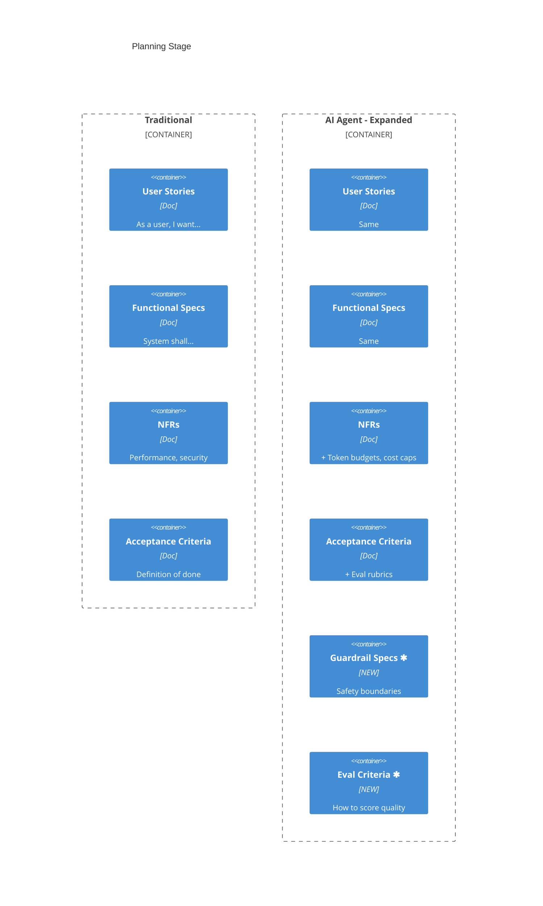
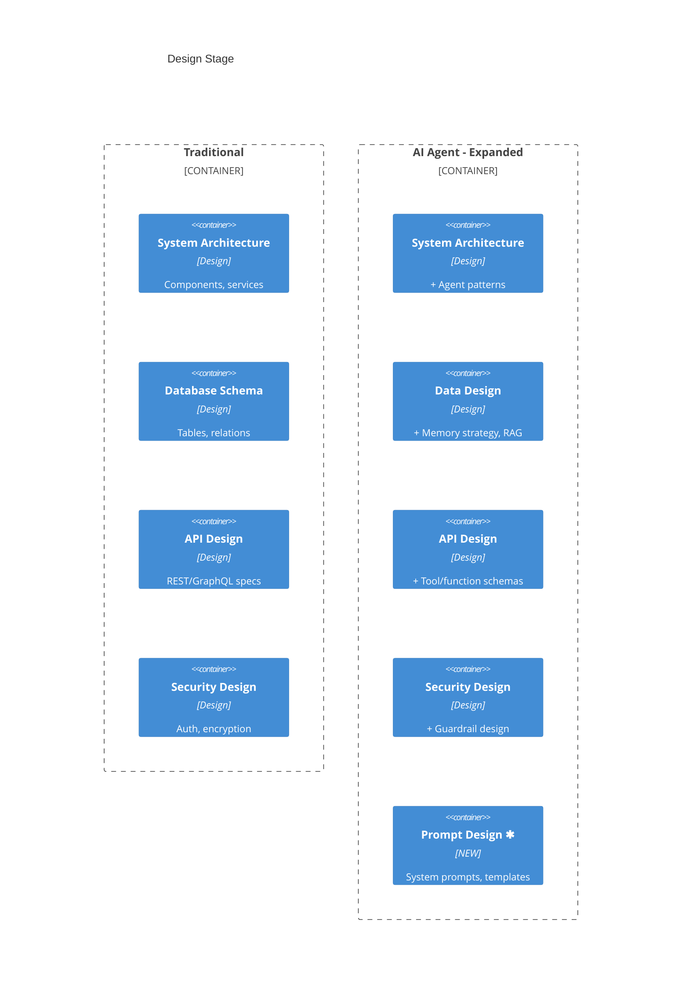
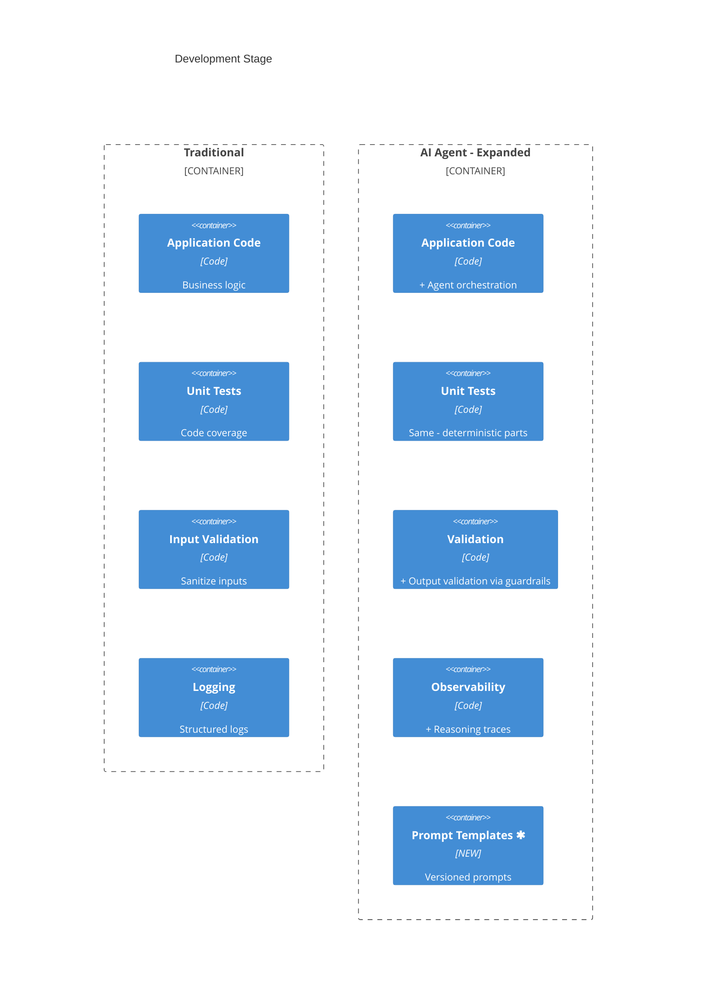
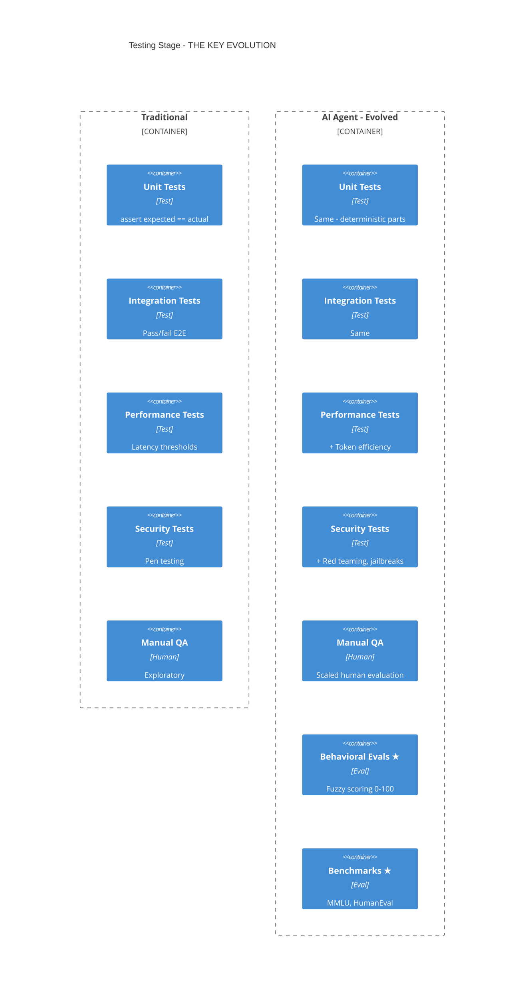
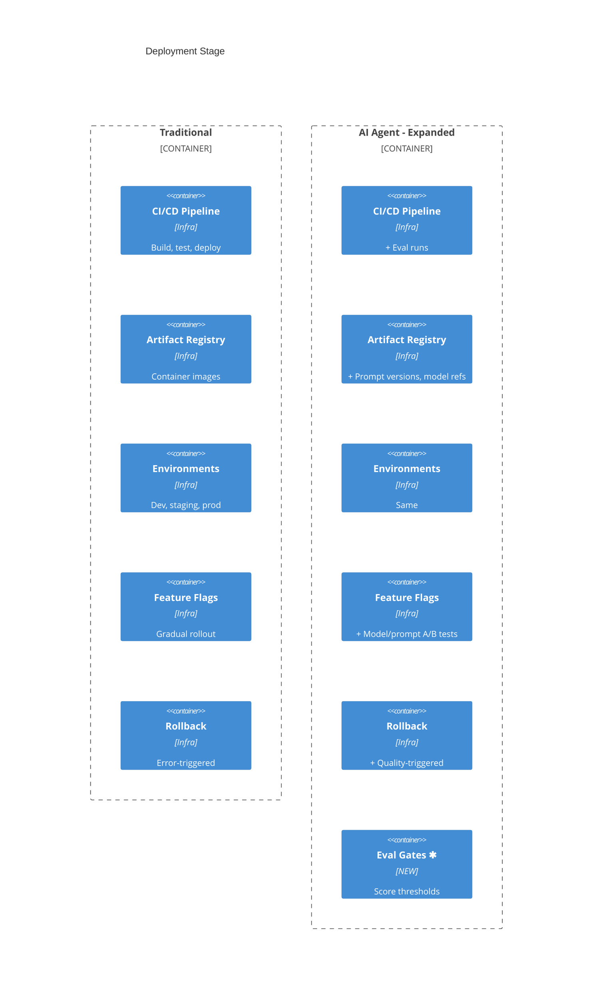
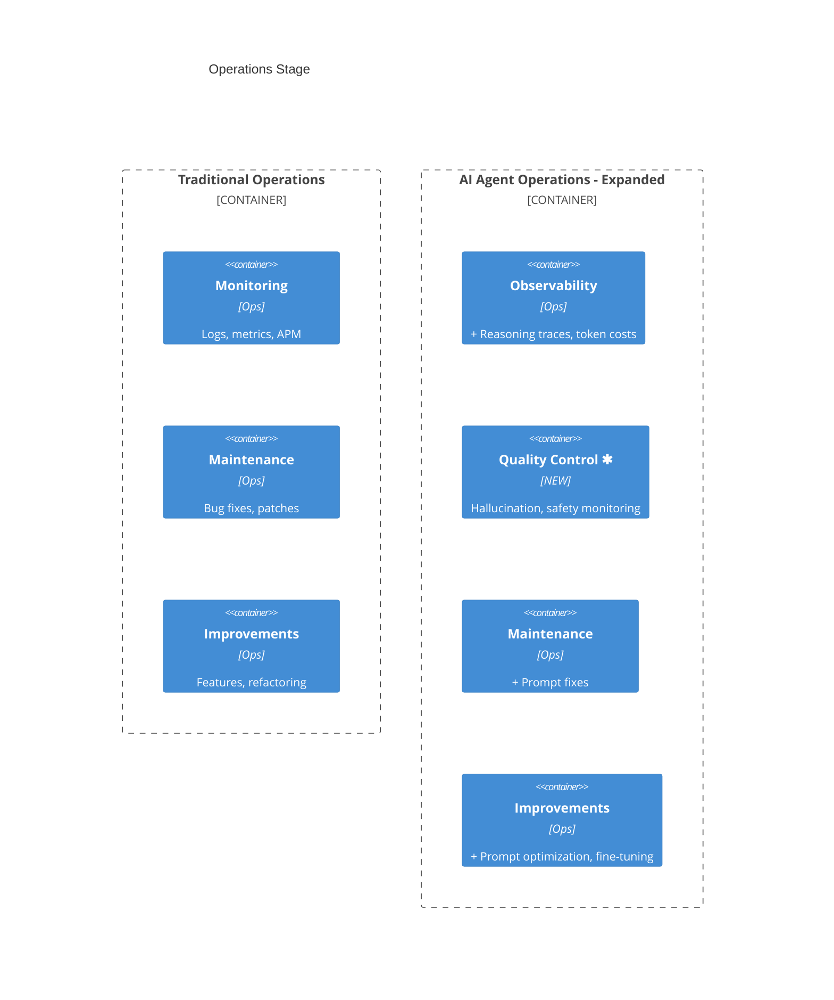

# Stage-by-Stage Comparison: Traditional vs AI Agent SDLC

> Evolution, not revolution. Same stages, expanded scope, one fundamental shift.

## Core Principle

Both SDLCs follow the **same fundamental cycle**. The AI Agent SDLC **expands** existing stages and **evolves** testing to handle non-determinism.



## Visual Overview



**★ Evolve** = Fundamental change (binary → scoring)
**Expand** = Same concept, additional scope

---

## Summary: What Changes?

| Stage | Change | What's Added | Why |
|-------|--------|--------------|-----|
| Planning | Expand | Guardrail specs, eval criteria | Define safety boundaries upfront |
| Design | Expand | Prompt design, memory strategy, tools | New artifact types |
| Development | Expand | Prompt templates, tracing instrumentation | New artifacts, debug non-determinism |
| Testing | **Evolve** | Fuzzy scoring alongside pass/fail | Non-deterministic outputs |
| Deployment | Expand | Prompt versioning, eval gates | More artifacts to version |
| Operations | Expand | Quality Control substage | Detect hallucinations, safety issues |

---

## Stage 1: Planning

**Change type: EXPAND**

Both have planning. AI Agent planning adds safety boundaries and evaluation criteria.



| Aspect | Traditional | AI Agent | Change |
|--------|-------------|----------|--------|
| User stories | ✓ | ✓ | Same |
| Functional specs | ✓ | ✓ | Same |
| Performance NFRs | SLAs | + Token budgets, latency | Expand |
| Security NFRs | Security reqs | + Safety boundaries | Expand |
| Acceptance | Checklist | + Evaluation rubrics | Expand |
| **New** | - | Guardrail specs | ✱ Add |
| **New** | - | Eval criteria | ✱ Add |

### What to Add
- **Guardrail specs**: What content/actions are prohibited?
- **Eval criteria**: How do we measure "good enough"?
- **Cost budgets**: What's the token budget per request?
- **Failure modes**: What failures are acceptable?

---

## Stage 2: Design

**Change type: EXPAND**

Both have architecture and API design. AI Agent adds prompt design and memory strategy.



| Aspect | Traditional | AI Agent | Change |
|--------|-------------|----------|--------|
| System architecture | Components, services | + Agent patterns (ReAct, CoT) | Expand |
| Data design | Database schemas | + Memory strategy, RAG | Expand |
| API design | REST/GraphQL | + Tool/function schemas | Expand |
| Security design | Auth, encryption | + Guardrail design | Expand |
| **New** | - | Prompt design | ✱ Add |

### What to Add
- **Agent patterns**: ReAct, Chain-of-Thought, Plan-and-Execute, Multi-agent
- **Prompt design**: System prompts, few-shot examples, templates
- **Memory strategy**: Context window management, RAG, long-term memory
- **Tool schemas**: Function calling specifications

---

## Stage 3: Development

**Change type: EXPAND**

Both write code. AI Agent adds prompts as first-class artifacts and tracing for debugging.



| Aspect | Traditional | AI Agent | Change |
|--------|-------------|----------|--------|
| Application code | Business logic | + Agent orchestration | Expand |
| Unit tests | Code coverage | Same (for deterministic parts) | Same |
| Validation | Input validation | + Output validation | Expand |
| Observability | Logging | + Reasoning traces | Expand |
| **New** | - | Prompt templates | ✱ Add |

### What to Add
- **Prompt templates**: Version-controlled, parameterized prompts
- **Output validation**: Guardrails to validate LLM outputs
- **Tracing**: Instrument reasoning chains for debugging
- **Tool implementations**: Function handlers for agent tools

---

## Stage 4: Testing

**Change type: EVOLVE ★**

This is the **fundamental paradigm shift**. Traditional testing uses pass/fail assertions. AI Agent testing adds fuzzy scoring because outputs are non-deterministic.



| Aspect | Traditional | AI Agent | Change |
|--------|-------------|----------|--------|
| Unit tests | Pass/fail | Same - deterministic parts | Same |
| Integration tests | Pass/fail | Same | Same |
| Performance tests | Latency thresholds | + Token efficiency | Expand |
| Security tests | Pen testing | + Red teaming, jailbreaks | Expand |
| Manual QA | Exploratory | Scaled human evaluation | Expand |
| **New** | - | Behavioral evals (scoring) | ★ Evolve |
| **New** | - | Benchmarks | ★ Add |
| **New** | - | Eval dataset management | ★ Add |

### The Core Shift

```
Traditional:  assert(output == expected)     → Pass or Fail
AI Agent:     score(output, criteria) → 0-100  → Quality score
```

**Why?** Same input can produce different (but equally valid) outputs. You can't assert exact equality.

### What to Add
- **Behavioral evals**: Score outputs against rubrics (not just pass/fail)
- **LLM-as-Judge**: Use an LLM to evaluate outputs
- **Benchmarks**: MMLU, HumanEval, MT-Bench for baseline
- **Red teaming**: Test for jailbreaks, prompt injection
- **Regression tracking**: Monitor score changes over time
- **Eval dataset management**: Version and curate golden datasets (input/expected output pairs, scoring rubrics) that feed automated evals — continuously enriched from production failures (see Stage 6)

---

## Stage 5: Deployment

**Change type: EXPAND**

Both use CI/CD. AI Agent adds prompt versioning and eval-based quality gates.



| Aspect | Traditional | AI Agent | Change |
|--------|-------------|----------|--------|
| CI/CD pipeline | Build, test, deploy | + Eval runs | Expand |
| Artifacts | Container images | + Prompt versions, model refs | Expand |
| Environments | Dev, staging, prod | Same | Same |
| Feature flags | Gradual rollout | + Model/prompt A/B | Expand |
| Rollback triggers | Errors, latency | + Quality degradation | Expand |
| **New** | - | Eval gates | ✱ Add |

### What to Add
- **Prompt versioning**: Version prompts alongside code
- **Eval gates**: Minimum score thresholds for deployment
- **Model A/B testing**: Compare model/prompt variants
- **Quality-triggered rollback**: Rollback on score drops

---

## Stage 6: Operations

**Change type: EXPAND (with new substage)**

Both have monitoring, maintenance, and continuous improvement. AI Agent expands monitoring to include traces and costs, and adds a **Quality Control substage**.



### Observability (Monitoring expanded)

| Aspect | Traditional | AI Agent | Change |
|--------|-------------|----------|--------|
| Logs | Structured logs | Same | Same |
| Metrics | Latency, throughput | + Token counts | Expand |
| APM | Request tracing | + Reasoning chain traces | Expand |
| Costs | Infrastructure | + Per-request token costs | Expand |
| Alerts | Error rates, latency | + Quality score drops | Expand |

### Quality Control (New substage) ✱

This is a **new substage** within Operations, focused on AI-specific failure modes.

| Capability | Description |
|------------|-------------|
| Output scoring | Real-time quality assessment |
| Hallucination detection | Fact verification, grounding checks |
| Safety monitoring | Content policy violations |
| Human feedback | Collect ratings, corrections |
| Drift detection | Quality changes over time |
| Dataset curation | Production failures → new eval test cases |

### Maintenance & Improvements (Expanded)

| Aspect | Traditional | AI Agent | Change |
|--------|-------------|----------|--------|
| Quick fixes | Code patches | + Prompt adjustments | Expand |
| Bug fixes | Code changes | + Prompt refinement | Expand |
| Improvements | New features | + Fine-tuning, RLHF | Expand |
| Data | Test data | + Eval dataset curation, training data | Expand |

---

## Change Summary

| Stage | Type | Traditional | AI Agent Additions |
|-------|------|-------------|-------------------|
| Planning | Expand | Requirements, specs | + Guardrails, eval criteria |
| Design | Expand | Architecture, APIs | + Prompts, memory, tools |
| Development | Expand | Code, tests | + Prompt templates, tracing |
| Testing | **Evolve** | Pass/fail | + **Fuzzy scoring (evals)**, eval datasets |
| Deployment | Expand | CI/CD, flags | + Prompt versions, eval gates |
| Operations | Expand | Monitor, maintain | + **Quality Control substage** |

---

## New Concepts Reference

| Concept | Stage | Traditional Equivalent | What's Different |
|---------|-------|----------------------|------------------|
| Guardrail specs | Planning | Security requirements | + Safety, content policies |
| Prompt design | Design | - | New artifact type |
| Memory strategy | Design | Database design | Context windows, RAG |
| Prompt templates | Development | Config files | First-class versioned artifact |
| Reasoning traces | Development | Logs | Full decision chain |
| Behavioral evals | Testing | - | Scoring, not pass/fail |
| LLM-as-Judge | Testing | - | LLM evaluates LLM |
| Red teaming | Testing | Pen testing | + Jailbreaks, prompt injection |
| Eval datasets | Testing ↔ Operations | Test fixtures | Versioned golden sets, curated from production |
| Eval gates | Deployment | Test gates | Score thresholds |
| Quality Control | Operations | - | New substage |
| Hallucination detection | Operations | - | New failure mode |
| Fine-tuning | Operations | - | New improvement method |

---

## Migration Guide

### What You Keep (No Change)
- Version control (Git)
- CI/CD pipelines (extend them)
- Code review processes
- Unit tests (for deterministic parts)
- Incident management
- On-call processes

### What You Expand
| Existing Practice | Expansion |
|-------------------|-----------|
| Requirements docs | + Guardrail specs, eval criteria |
| Architecture diagrams | + Agent patterns, prompt design |
| Input validation | + Output validation via guardrails |
| Logging | + Reasoning traces |
| Performance tests | + Token efficiency |
| Security tests | + Red teaming |
| Artifact registry | + Prompt versions |
| Feature flags | + Model A/B testing |
| Monitoring | + Token costs, quality scores |
| Test data / fixtures | + Eval dataset management, golden sets |

### What You Add (New)
- Prompt templates as versioned artifacts
- Behavioral evals with scoring
- LLM-as-Judge evaluation
- Eval dataset management (golden sets, versioning, curation pipeline)
- Quality Control monitoring
- Human feedback collection
- Fine-tuning/RLHF pipelines (if needed)

### What You Learn
- Prompt engineering
- Eval design and scoring rubrics
- LLM observability tools
- Token cost optimization

---

**Next**: [Tools Landscape →](04-tools-landscape.md)
