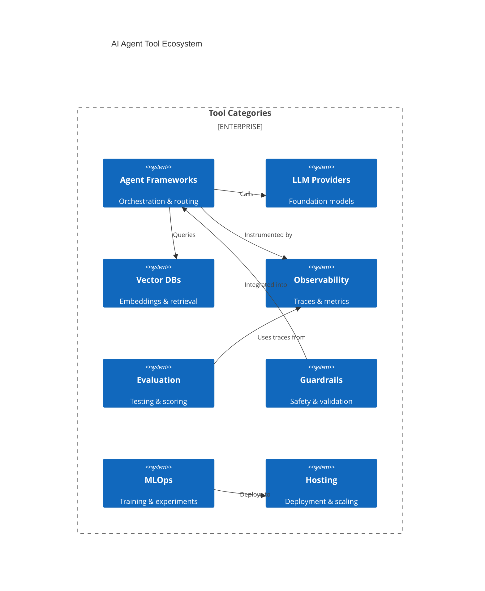

# AI Agent SDLC Tools Landscape

> Reference guide for tools at each stage of the AI agent development lifecycle.

## Tool Ecosystem Overview



---

## By Stage

### Stage 1: Planning

| Category | Tool | Description | Link |
|----------|------|-------------|------|
| **Project Management** | Jira | Issue tracking, sprints | jira.atlassian.com |
| | Linear | Modern issue tracking | linear.app |
| | Notion | Docs + project management | notion.so |
| **Prompt Management** | PromptLayer | Prompt versioning, logging | promptlayer.com |
| | Humanloop | Prompt IDE, versioning | humanloop.com |
| | Agenta | Open-source prompt management | agenta.ai |
| **Eval Design** | Braintrust | Eval platform, scoring | braintrust.dev |
| | Scorecard | Eval design | getscorecard.ai |

---

### Stage 2: Design

| Category | Tool | Description | Link |
|----------|------|-------------|------|
| **Agent Frameworks** | LangChain | Most popular agent framework | langchain.com |
| | LlamaIndex | Data framework for LLMs | llamaindex.ai |
| | AutoGen | Microsoft multi-agent | github.com/microsoft/autogen |
| | CrewAI | Role-based multi-agent | crewai.com |
| | Semantic Kernel | Microsoft SDK | github.com/microsoft/semantic-kernel |
| **Prompt IDEs** | PromptLayer | Visual prompt editing | promptlayer.com |
| | Humanloop | Playground + versioning | humanloop.com |
| | Agenta | Open-source prompt IDE | agenta.ai |
| **Vector DBs** | Pinecone | Managed vector DB | pinecone.io |
| | Weaviate | Open-source vector DB | weaviate.io |
| | Chroma | Lightweight, open-source | trychroma.com |
| | Qdrant | Open-source, Rust-based | qdrant.tech |
| | Milvus | Scalable vector DB | milvus.io |
| **Diagramming** | Miro | Collaborative whiteboard | miro.com |
| | Excalidraw | Hand-drawn diagrams | excalidraw.com |

---

### Stage 3: Development

| Category | Tool | Description | Link |
|----------|------|-------------|------|
| **Agent Frameworks** | LangChain | Chains, agents, tools | langchain.com |
| | LlamaIndex | Indexing, retrieval, agents | llamaindex.ai |
| | Haystack | Open-source NLP framework | haystack.deepset.ai |
| | AutoGen | Multi-agent conversations | github.com/microsoft/autogen |
| | CrewAI | Crew-based agents | crewai.com |
| **LLM APIs** | OpenAI | GPT-4, GPT-4o | openai.com |
| | Anthropic | Claude 3, Claude 3.5 | anthropic.com |
| | Google | Gemini | ai.google.dev |
| | Cohere | Command, Embed | cohere.com |
| | Mistral | Open-weight models | mistral.ai |
| | Groq | Fast inference | groq.com |
| **Guardrails** | Guardrails AI | Output validation | guardrailsai.com |
| | NeMo Guardrails | NVIDIA's guardrails | github.com/NVIDIA/NeMo-Guardrails |
| | Rebuff | Prompt injection detection | rebuff.ai |
| | LLM Guard | I/O scanning | llm-guard.com |
| **Tracing SDKs** | LangSmith | LangChain's tracing | smith.langchain.com |
| | LangFuse | Open-source tracing | langfuse.com |
| | Arize Phoenix | Open-source observability | phoenix.arize.com |
| | OpenLLMetry | OpenTelemetry for LLMs | openllmetry.com |

---

### Stage 4: Evaluation

| Category | Tool | Description | Link |
|----------|------|-------------|------|
| **Eval Frameworks** | Promptfoo | CLI-based eval testing | promptfoo.dev |
| | RAGAS | RAG evaluation | ragas.io |
| | DeepEval | LLM evaluation framework | deepeval.com |
| | Evalplus | Code eval benchmarks | github.com/evalplus |
| | Inspect AI | UK AISI eval framework | inspect.ai-safety-institute.org.uk |
| **Eval Platforms** | Braintrust | Managed eval platform | braintrust.dev |
| | LangSmith Evals | LangChain's eval tools | smith.langchain.com |
| | Humanloop | Eval + prompt management | humanloop.com |
| **Benchmarks** | MMLU | Multi-task understanding | github.com/hendrycks/test |
| | HumanEval | Code generation | github.com/openai/human-eval |
| | MT-Bench | Multi-turn chat | github.com/lm-sys/FastChat |
| | AlpacaEval | Instruction following | github.com/tatsu-lab/alpaca_eval |
| | HELM | Holistic evaluation | crfm.stanford.edu/helm |
| **Red Teaming** | Garak | LLM vulnerability scanner | garak.ai |
| | Promptfoo | Adversarial testing | promptfoo.dev |
| | Microsoft PyRIT | Red team toolkit | github.com/Azure/PyRIT |
| **Human Eval** | Scale AI | Data labeling platform | scale.com |
| | Surge AI | Human annotation | surgehq.ai |
| | Labelbox | Labeling platform | labelbox.com |
| | Argilla | Open-source annotation | argilla.io |
| **Eval Dataset Management** | Braintrust | Built-in dataset versioning + eval runner | braintrust.dev |
| | LangSmith Datasets | Dataset store with test case management | smith.langchain.com |
| | Humanloop | Dataset management + prompt evals | humanloop.com |
| | DVC | Git-based data versioning | dvc.org |
| | Hugging Face Datasets | Dataset hosting, loading, sharing | huggingface.co/docs/datasets |
| | Promptfoo | File-based (YAML/JSON in Git) | promptfoo.dev |

> **Cross-cutting note**: Eval datasets have a lifecycle. They start here (Stage 4) as curated golden sets consumed by eval runners, but are continuously enriched in [Stage 8: Iteration](#stage-8-iteration) where production failures and human feedback become new test cases. See [Dataset Curation Pipeline](#dataset-curation-pipeline) below.

---

### Stage 5: Deployment

| Category | Tool | Description | Link |
|----------|------|-------------|------|
| **LLM Hosting** | AWS Bedrock | Managed LLM service | aws.amazon.com/bedrock |
| | Azure OpenAI | OpenAI on Azure | azure.microsoft.com |
| | Google Vertex AI | Google's ML platform | cloud.google.com/vertex-ai |
| | Anyscale | Scalable LLM inference | anyscale.com |
| **Agent Hosting** | Modal | Serverless compute | modal.com |
| | Replicate | Model hosting | replicate.com |
| | Baseten | ML infrastructure | baseten.co |
| | Beam | Serverless GPUs | beam.cloud |
| **Experiment Tracking** | Weights & Biases | ML experiment tracking | wandb.ai |
| | MLflow | Open-source MLOps | mlflow.org |
| | Comet | Experiment management | comet.com |
| **Feature Management** | LaunchDarkly | Feature flags | launchdarkly.com |
| | Statsig | Feature gates + A/B | statsig.com |
| | Unleash | Open-source flags | getunleash.io |

---

### Stage 6: Observability

| Category | Tool | Description | Link |
|----------|------|-------------|------|
| **LLM Observability** | LangSmith | LangChain's platform | smith.langchain.com |
| | LangFuse | Open-source alternative | langfuse.com |
| | Arize Phoenix | Open-source traces | phoenix.arize.com |
| | Helicone | LLM observability | helicone.ai |
| | Portkey | LLM gateway + observability | portkey.ai |
| **Cost Tracking** | Helicone | Cost monitoring | helicone.ai |
| | OpenMeter | Usage metering | openmeter.io |
| | Portkey | Cost analytics | portkey.ai |
| **General APM** | Datadog | APM with LLM integrations | datadoghq.com |
| | New Relic | Observability platform | newrelic.com |
| | Grafana | Dashboards + alerting | grafana.com |

---

### Stage 7: Quality Control

| Category | Tool | Description | Link |
|----------|------|-------------|------|
| **Quality Scoring** | Braintrust | Online scoring | braintrust.dev |
| | RAGAS | RAG quality metrics | ragas.io |
| | Custom LLM-as-Judge | Use LLM to evaluate | - |
| **Hallucination Detection** | Vectara | Hallucination detection | vectara.com |
| | Chainpoll | Fact verification | - |
| | Grounding checks | Custom RAG verification | - |
| **Safety Monitoring** | Guardrails AI | Runtime guardrails | guardrailsai.com |
| | Azure Content Safety | Content moderation | azure.microsoft.com |
| | Perspective API | Toxicity detection | perspectiveapi.com |
| | OpenAI Moderation | Content moderation | openai.com |
| **Feedback Collection** | Retool | Internal tools | retool.com |
| | Custom UI components | Thumbs up/down, feedback forms | - |

---

### Stage 8: Iteration

| Category | Tool | Description | Link |
|----------|------|-------------|------|
| **Prompt Optimization** | DSPy | Programmatic prompts | dspy-docs.vercel.app |
| | TextGrad | Gradient-based optimization | github.com/zou-group/textgrad |
| | OPRO | LLM-based optimization | - |
| **Fine-tuning** | OpenAI Fine-tuning | GPT fine-tuning | platform.openai.com |
| | Together AI | Open model fine-tuning | together.ai |
| | Fireworks | Model customization | fireworks.ai |
| | Anyscale | Distributed fine-tuning | anyscale.com |
| **RLHF/DPO** | Hugging Face TRL | RLHF library | huggingface.co/docs/trl |
| | OpenRLHF | Distributed RLHF | github.com/OpenRLHF |
| **Dataset Management** | Argilla | Data labeling + annotation | argilla.io |
| | Label Studio | Open-source labeling | labelstud.io |
| | Lilac | Dataset exploration + curation | lilacml.com |
| | Cleanlab | Data quality assessment | cleanlab.ai |
| | DVC | Dataset versioning (Git-based) | dvc.org |
| | Hugging Face Datasets | Dataset hosting + sharing | huggingface.co/docs/datasets |
| **Experiment Tracking** | Weights & Biases | ML experiments | wandb.ai |
| | MLflow | Open-source tracking | mlflow.org |

> **Cross-cutting note**: Dataset management here focuses on curating **training data** from production failures. This feeds back to [Stage 4: Evaluation](#stage-4-evaluation) — production failures become eval test cases, human corrections become golden answers. See [Dataset Curation Pipeline](#dataset-curation-pipeline) below.

---

### Dataset Curation Pipeline

The lifecycle of an eval dataset spans Stage 4 (consumption) and Stage 8 (curation):

```
┌─────────────────────────────────────────────────────────────────┐
│                   Dataset Curation Pipeline                      │
│                                                                  │
│  Production ──→ Traces ──→ Failure    ──→ Human      ──→ Golden  │
│  Traffic        (Stage 6)   Detection      Review        Dataset │
│                             (Stage 7)      (Stage 8)    (Stage 4)│
│                                                                  │
│  Tools:         LangFuse    Braintrust     Argilla      Braintrust│
│                 LangSmith   Custom rules   Label Studio LangSmith│
│                 Arize       LLM-as-Judge   Lilac        HF Datasets│
│                                            Cleanlab     DVC      │
└─────────────────────────────────────────────────────────────────┘
```

| Phase | What Happens | Key Tools |
|-------|--------------|-----------|
| **Collect** | Production traces captured with inputs/outputs | LangFuse, LangSmith, Arize |
| **Detect** | Flag low-quality outputs, hallucinations, failures | Braintrust, custom rules, LLM-as-Judge |
| **Curate** | Human review, label corrections, quality filtering | Argilla, Label Studio, Lilac, Cleanlab |
| **Version** | Store as versioned eval dataset, track changes | DVC, HF Datasets, Braintrust, LangSmith |
| **Evaluate** | Run automated evals against golden datasets | Promptfoo, Braintrust, DeepEval |

---

## Tool Selection Matrix

### By Team Size

| Team Size | Recommended Stack |
|-----------|-------------------|
| **Solo/Small (1-3)** | LangChain + OpenAI + Promptfoo + LangFuse |
| **Medium (4-10)** | LangChain + Multiple LLMs + Braintrust + LangSmith |
| **Large (10+)** | Custom framework + Bedrock/Vertex + W&B + Custom evals |

### By Use Case

| Use Case | Key Tools |
|----------|-----------|
| **Chatbot** | LangChain, Guardrails AI, LangSmith |
| **RAG System** | LlamaIndex, Pinecone/Weaviate, RAGAS |
| **Code Agent** | AutoGen, HumanEval, Promptfoo |
| **Multi-Agent** | AutoGen/CrewAI, LangSmith, Custom evals |
| **Enterprise** | Azure OpenAI, NeMo Guardrails, Datadog |

### By Budget

| Budget | Stack |
|--------|-------|
| **Free/OSS** | LangChain + Ollama + LangFuse + Promptfoo |
| **Startup** | LangChain + OpenAI + LangSmith + Braintrust |
| **Enterprise** | Custom + Azure/Bedrock + Datadog + Custom |

---

## Emerging Tools to Watch

| Tool | Category | Why Notable |
|------|----------|-------------|
| **Instructor** | Structured outputs | Type-safe LLM outputs |
| **Outlines** | Structured generation | Constrained decoding |
| **vLLM** | Inference | Fast self-hosted inference |
| **Ollama** | Local LLMs | Easy local model running |
| **LiteLLM** | LLM Gateway | Unified API for all LLMs |
| **Marvin** | AI functions | Pythonic AI toolkit |
| **Guidance** | Constrained generation | Microsoft's control flow |

---

## Integration Patterns

### Typical Stack

```
┌─────────────────────────────────────────────────────────┐
│                    Application Layer                     │
│  (Your code, API endpoints, UI)                         │
└─────────────────────────────────────────────────────────┘
                           │
┌─────────────────────────────────────────────────────────┐
│                   Agent Framework                        │
│  (LangChain, LlamaIndex, AutoGen)                       │
└─────────────────────────────────────────────────────────┘
         │              │              │
┌────────┴───┐  ┌──────┴──────┐  ┌───┴────────┐
│ LLM APIs   │  │ Vector DBs  │  │ Guardrails │
│ OpenAI     │  │ Pinecone    │  │ Guardrails │
│ Anthropic  │  │ Weaviate    │  │ AI         │
└────────────┘  └─────────────┘  └────────────┘
         │              │              │
┌─────────────────────────────────────────────────────────┐
│                   Observability                          │
│  (LangSmith, LangFuse, Arize Phoenix)                   │
└─────────────────────────────────────────────────────────┘
                           │
┌─────────────────────────────────────────────────────────┐
│                    Evaluation                            │
│  (Promptfoo, Braintrust, RAGAS)                         │
└─────────────────────────────────────────────────────────┘
```

---

**Back to**: [README](README.md)
