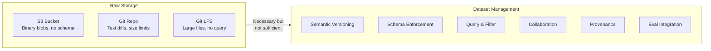
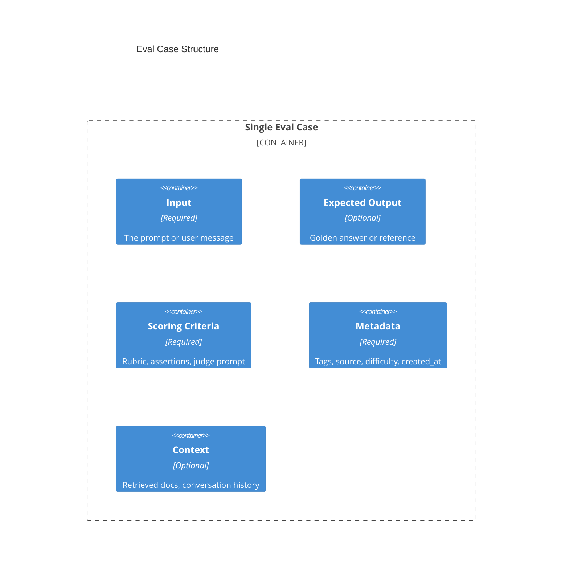
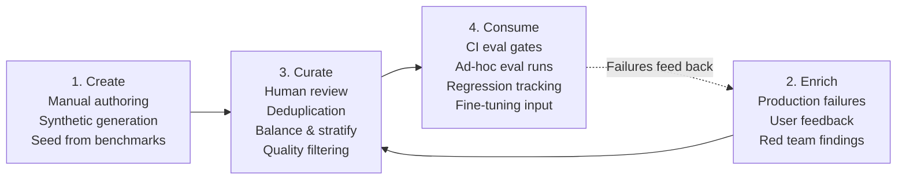
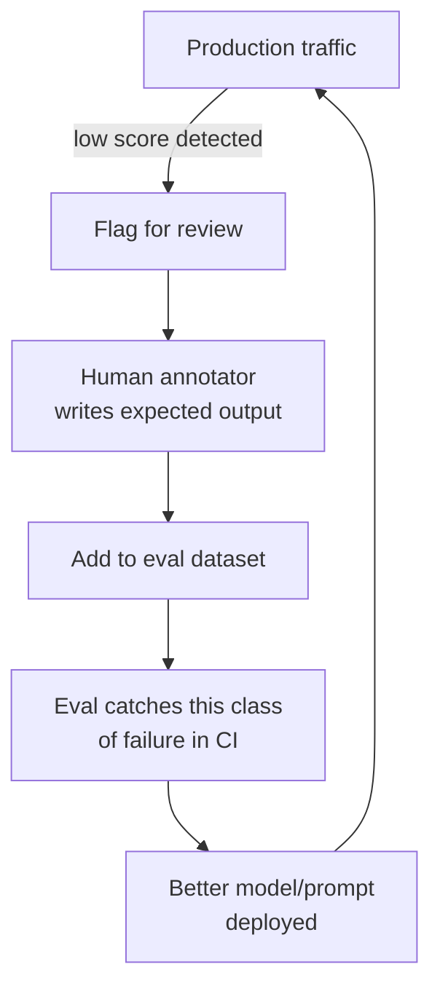
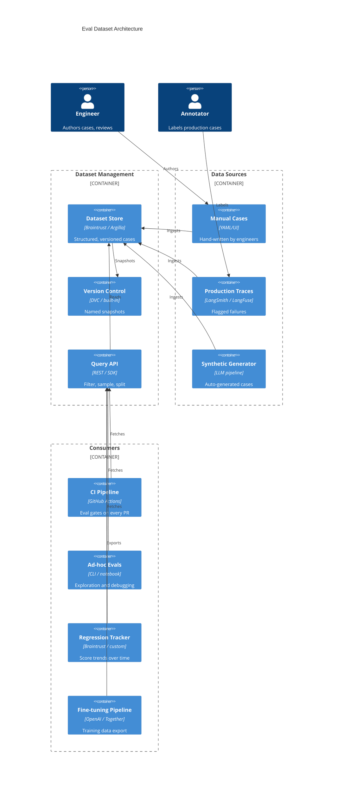

# Eval Dataset Management

> Why raw S3 and Git aren't enough for managing the datasets that drive automated evaluations.

## The Problem

Eval datasets are the **test suites of AI agent development**. They define what "good" looks like. But unlike traditional test fixtures (static JSON checked into Git), eval datasets are:

- **Living** — continuously enriched from production failures
- **Structured** — each case has input, expected output, metadata, scoring criteria
- **Collaborative** — curated by engineers, annotators, and domain experts
- **Large** — can grow to tens of thousands of cases
- **Multi-purpose** — same data feeds evals, fine-tuning, and regression tracking

Storing them as flat files in S3 or Git treats them like static artifacts. They're not. They're a **data product** with its own lifecycle.

---

## Why Raw S3/Git Falls Short



| Capability | S3 | Git | Git LFS | Dataset Management Tool |
|------------|:--:|:---:|:-------:|:-----------------------:|
| Store large files | Yes | No | Yes | Yes |
| Text diffing | No | Yes | No | Yes (structured) |
| Schema enforcement | No | No | No | Yes |
| Query/filter by field | No | No | No | Yes |
| Provenance tracking | No | No | No | Yes |
| Annotation workflows | No | No | No | Yes |
| Semantic versioning | No | Tags only | Tags only | Yes |
| Eval runner integration | Manual | Manual | Manual | Native |
| Concurrent editing | Overwrite risk | Merge conflicts | Merge conflicts | Managed |
| Cost at scale (100K+ cases) | Cheap | Repo bloat | OK | Varies |

### Specific Failures of Raw Storage

**Git breaks at scale**: A 50K-row JSONL eval dataset generates massive diffs. Code review becomes impossible. `git blame` is useless. Repo clone times grow.

**S3 has no schema**: Nothing stops you from uploading a dataset missing the `expected_output` field. You find out when your eval runner crashes at 3am.

**No query capability**: "Show me all eval cases tagged `hallucination` that came from production in Q4" requires downloading the entire file and writing custom scripts.

**No lineage**: Six months later, you can't tell which cases were hand-written, which came from production failures, and which were synthetically generated. You can't assess dataset quality.

**No collaboration**: Two annotators label the same batch. Who wins? Git merge on JSONL is a nightmare.

---

## Eval Dataset Anatomy

An eval dataset isn't just input/output pairs. Each case carries structured metadata.



### Case Schema

```yaml
# Minimal eval case
- input: "What is the capital of France?"
  expected: "Paris"
  scoring: exact_match
  tags: [geography, factual, easy]
  source: manual
  created_at: 2025-01-15

# Rich eval case
- input: "Summarize this earnings report for a non-financial audience"
  context:
    documents: ["s3://datasets/earnings/AAPL-Q4-2025.pdf"]
  expected: null  # No single correct answer
  scoring:
    method: llm_as_judge
    judge_prompt: |
      Rate the summary on: accuracy (1-5), clarity (1-5), completeness (1-5).
      Penalize for jargon. Penalize for hallucinated numbers.
    threshold: 3.5
  tags: [summarization, finance, hard]
  source: production_failure
  source_trace_id: "trace_abc123"
  created_at: 2025-03-20
  annotated_by: "reviewer@company.com"
  difficulty: hard
  split: test
```

### Key Fields

| Field | Purpose | Why Not in S3/Git |
|-------|---------|-------------------|
| `input` | What to send to the agent | Same everywhere |
| `expected` | Golden answer (if deterministic) | Same everywhere |
| `scoring` | How to evaluate (method + criteria) | Needs validation, evolves independently |
| `tags` | Category labels for filtering/slicing | Need queryable index |
| `source` | Where this case came from | Provenance tracking |
| `source_trace_id` | Link to production trace | Cross-system lineage |
| `split` | train/test/validation assignment | Needs managed splitting logic |
| `difficulty` | Stratification for balanced sampling | Needs query + sampling |
| `annotated_by` | Who reviewed/created this case | Audit trail |
| `version_added` | Which dataset version introduced it | Needs semantic versioning |

---

## Versioning: Not the Same as Git

Git versions **files**. Dataset management versions **datasets as semantic units**.

| Aspect | Git Versioning | Dataset Versioning |
|--------|---------------|-------------------|
| Unit of change | Line diff | Case added/modified/removed |
| Version ID | SHA hash | Named version (v3.2) or content hash |
| Changelog | Commit message | "Added 47 production failure cases, removed 12 duplicates" |
| Branching | Code branches | Dataset variants (e.g., `main`, `hard-cases-only`, `finance-subset`) |
| Comparison | Text diff | Dataset diff (cases added, removed, score distribution change) |
| Rollback | `git checkout` | Restore named snapshot |
| Size impact | Full repo history | Deduplicated storage |

### What Semantic Versioning Looks Like

```
v1.0 — Initial golden dataset (200 cases, hand-written)
v1.1 — Added 50 cases from first production week
v2.0 — Schema change: added `difficulty` field
v2.1 — Added 120 production failure cases from Q2
v2.2 — Removed 30 duplicate/overlapping cases
v3.0 — Split into domain-specific subsets
```

Each version is a **reproducible snapshot**. When eval scores drop, you can diff v2.1 vs v2.2 to see if the dataset change caused it or if the model regressed.

---

## The Dataset Lifecycle



### Phase 1: Create (Bootstrap)

Start with a hand-written golden dataset. This is your **seed**.

| Source | Description | Quality | Cost |
|--------|-------------|---------|------|
| **Manual authoring** | Domain experts write cases | High | Expensive |
| **Benchmark adaptation** | Adapt MMLU/HumanEval to your domain | Medium | Cheap |
| **Synthetic generation** | LLM generates cases, human validates | Medium | Cheap at scale |
| **Production sampling** | Sample real traffic as starting cases | High relevance | Needs annotation |

### Phase 2: Enrich (Continuous)

Once in production, the dataset grows organically.

```
Production trace (low quality score)
    → Extract input + actual output
    → Human annotator writes corrected expected output
    → Tag with failure mode (hallucination, refusal, etc.)
    → Add to eval dataset
```

This is the **dataset flywheel**: failures become test cases, test cases prevent future failures.

### Phase 3: Curate (Quality Gate)

Raw data isn't ready for evals. Curation ensures dataset quality.

| Activity | Why |
|----------|-----|
| **Deduplication** | Near-duplicate cases inflate scores artificially |
| **Balance checking** | 90% easy cases = misleading high scores |
| **Difficulty stratification** | Ensure representation across easy/medium/hard |
| **Annotation review** | Catch incorrect golden answers |
| **Staleness check** | Remove cases that no longer apply (deprecated features) |
| **Contamination check** | Ensure test cases aren't in training data |

### Phase 4: Consume (Integration)

| Consumer | How It Uses the Dataset |
|----------|------------------------|
| **CI pipeline** | Run evals on every PR, block deploys below threshold |
| **Regression tracking** | Compare scores across model/prompt versions |
| **Ad-hoc exploration** | Engineers investigate specific failure categories |
| **Fine-tuning** | Training split feeds model improvement |
| **Benchmarking** | Compare different models on the same dataset |

---

## Core Requirements for a Dataset Management System

### 1. Structured Storage with Schema

```
┌─────────────────────────────────────┐
│         Dataset "customer-support"   │
│         Version: v2.3                │
│         Cases: 4,200                 │
│         Schema: v2 (with difficulty) │
├─────────────────────────────────────┤
│ input        │ text     │ required  │
│ expected     │ text     │ optional  │
│ context      │ json     │ optional  │
│ scoring      │ json     │ required  │
│ tags         │ string[] │ required  │
│ source       │ enum     │ required  │
│ difficulty   │ enum     │ required  │
│ split        │ enum     │ required  │
│ created_at   │ datetime │ auto      │
│ annotated_by │ string   │ optional  │
└─────────────────────────────────────┘
```

**Why it matters**: Schema enforcement catches malformed cases before they break eval runs.

### 2. Query and Filtering

You need to ask questions like:
- "All cases tagged `hallucination` from production"
- "Hard cases only, for the `finance` domain"
- "Cases added since v2.0"
- "Cases where the model scored below 0.5 on the last eval run"

Without query capability, you download 10GB of JSONL and write pandas scripts.

### 3. Sampling and Splits

| Capability | Description |
|------------|-------------|
| **Stratified sampling** | Ensure proportional representation by tag/difficulty |
| **Deterministic splits** | Same train/test split every run for reproducibility |
| **Subset creation** | Domain-specific slices (finance, medical, general) |
| **Balanced subsets** | Equal representation across categories |

### 4. Provenance and Lineage

Every case should answer:
- **Where did it come from?** (manual, production, synthetic, red-team)
- **Who reviewed it?** (annotator ID, review timestamp)
- **When was it added?** (dataset version)
- **What production trace?** (link back to observability platform)

### 5. Collaboration Workflows

| Workflow | Description |
|----------|-------------|
| **Annotation** | Assign cases to reviewers, track completion |
| **Review** | Second reviewer validates annotations |
| **Conflict resolution** | Multiple annotators disagree on expected output |
| **Bulk operations** | Re-tag, re-score, or retire batches of cases |

### 6. Eval Runner Integration

The dataset management system should feed directly into eval frameworks:

```
Dataset (query: tags=hallucination, split=test)
    → Promptfoo / Braintrust / DeepEval
    → Score results
    → Results written back with dataset version reference
```

Without integration, you export CSV, write glue scripts, and lose the version reference.

---

## Tool Comparison

### Integrated Eval Platforms

Tools where dataset management is built into the eval workflow.

| Tool | Dataset Features | Versioning | Query | Annotation | Eval Integration |
|------|-----------------|:----------:|:-----:|:----------:|:----------------:|
| **Braintrust** | First-class datasets API, CRUD operations | Content-hash based | Yes (API) | No | Native |
| **LangSmith** | Dataset store, examples, test runs | Snapshot-based | Yes (API/UI) | Basic | Native |
| **Humanloop** | Datasets + prompt management | Yes | Yes (UI) | Yes | Native |

**Best for**: Teams that want one platform for evals + datasets. Less flexibility, more convenience.

### Annotation-First Tools

Tools built for data labeling that can serve as dataset management.

| Tool | Dataset Features | Versioning | Query | Annotation | Eval Integration |
|------|-----------------|:----------:|:-----:|:----------:|:----------------:|
| **Argilla** | Records + fields + metadata, search | Workspace-based | Yes (search/filter) | Full workflow | Export to eval |
| **Label Studio** | Configurable labeling UI, tasks | Project-based | Yes (filter) | Full workflow | Export to eval |
| **Lilac** | Exploration, enrichment, clustering | No (exploration tool) | Yes (semantic + filter) | No | Export |

**Best for**: Teams with dedicated annotators, complex labeling needs, or large-scale human review.

### Data Versioning Tools

Tools focused on versioning datasets as artifacts.

| Tool | Dataset Features | Versioning | Query | Annotation | Eval Integration |
|------|-----------------|:----------:|:-----:|:----------:|:----------------:|
| **DVC** | Git-like versioning for data files | Git-integrated | No (file-level) | No | Manual |
| **HF Datasets** | Hub hosting, streaming, splits | Git-based (Hub) | Yes (filter/map) | No | Load into any framework |
| **Cleanlab** | Quality scoring, issue detection | No | Yes (quality-based) | Auto-label | Export |

**Best for**: ML-oriented teams familiar with data versioning workflows, or teams needing public/shared datasets.

### File-Based Approach

| Tool | Dataset Features | Versioning | Query | Annotation | Eval Integration |
|------|-----------------|:----------:|:-----:|:----------:|:----------------:|
| **Promptfoo** | YAML/JSON test files in Git | Git commits | No | No | Native |
| **Custom JSONL** | Flat files on S3/Git | Manual | Script-based | No | Manual |

**Best for**: Small teams (<500 cases), simple eval needs, fast iteration.

---

## Decision Matrix

### By Dataset Size

| Scale | Cases | Recommended Approach |
|-------|-------|---------------------|
| **Small** | <500 | Promptfoo YAML in Git — simple, version-controlled |
| **Medium** | 500-10K | Braintrust/LangSmith datasets — managed, queryable |
| **Large** | 10K-100K | Argilla + DVC — annotation workflow + versioning |
| **Very large** | 100K+ | HF Datasets + custom pipeline — streaming, scalable |

### By Team Structure

| Team | Approach |
|------|----------|
| **Solo engineer** | Promptfoo YAML or LangSmith datasets |
| **Eng team, no annotators** | Braintrust or LangSmith |
| **Eng + annotation team** | Argilla or Label Studio + DVC |
| **ML team with data infra** | HF Datasets + Cleanlab + custom |

### By Primary Need

| Primary Need | Tool | Why |
|-------------|------|-----|
| Simplicity | Promptfoo | YAML in repo, zero infrastructure |
| Eval integration | Braintrust | Datasets and evals in one platform |
| Annotation quality | Argilla | Best annotation workflows (open-source) |
| Data versioning | DVC | Git-native, works with existing workflows |
| Scale + sharing | HF Datasets | Streaming, community, Hub hosting |
| Data quality | Cleanlab | Find mislabeled cases, duplicates, outliers |

---

## Patterns

### Pattern 1: Golden Dataset

A curated, high-quality dataset used as the ground truth for eval gates.

```
┌──────────────────────────────────────────┐
│            Golden Dataset v3.1            │
│                                          │
│  ┌──────────┐  ┌──────────┐  ┌────────┐ │
│  │ Core     │  │ Edge     │  │ Safety │ │
│  │ 200 cases│  │ 100 cases│  │ 50 cases│ │
│  │ easy+med │  │ hard     │  │ adversar│ │
│  └──────────┘  └──────────┘  └────────┘ │
│                                          │
│  Used by: CI pipeline (every PR)         │
│  Threshold: avg score >= 0.85            │
│  Updated: monthly review cycle           │
└──────────────────────────────────────────┘
```

**Rules**:
- Every case is human-reviewed
- Balanced by difficulty and category
- Updated on a regular cadence (not ad-hoc)
- Small enough to run in CI (< 10 min)

### Pattern 2: Dataset Flywheel

Production failures automatically feed the eval dataset.



**Implementation**:
1. Quality Control (Stage 7) flags outputs scoring below threshold
2. Flagged traces exported to Argilla/Label Studio for annotation
3. Annotated cases added to eval dataset with `source: production_failure`
4. Next CI run includes the new cases
5. Model/prompt must pass the new cases to deploy

### Pattern 3: Stratified Eval Suites

Instead of one monolithic dataset, maintain purpose-specific subsets.

| Suite | Purpose | Size | Run Frequency |
|-------|---------|------|---------------|
| **Smoke** | Basic sanity checks | 20-50 | Every commit |
| **Core** | Main functionality | 200-500 | Every PR |
| **Edge cases** | Known hard problems | 100-300 | Pre-deploy |
| **Safety** | Red team / adversarial | 50-200 | Pre-deploy |
| **Regression** | Previously-failed cases | Growing | Every PR |
| **Full** | Everything | All | Weekly / release |

### Pattern 4: Synthetic Dataset Generation

Use LLMs to generate eval cases, with human validation.

```
1. Define case template (schema + constraints)
2. LLM generates N candidate cases
3. Automated quality filter (dedup, format check)
4. Human reviews and corrects (sample or all)
5. Add to dataset with source: synthetic
```

**When to use**: Bootstrapping a new domain, expanding coverage of rare scenarios, stress-testing guardrails.

**Risk**: Synthetic cases may not reflect real user behavior. Always mix with production data.

---

## Anti-Patterns

| Anti-Pattern | Problem | Fix |
|-------------|---------|-----|
| **"The Big Dump"** | 10K cases in a single JSONL, never curated | Split into purpose-specific suites, review regularly |
| **No provenance** | Can't tell manual from synthetic from production | Tag every case with `source` and `created_at` |
| **Test-on-train** | Eval cases leak into fine-tuning data | Enforce strict splits, contamination checks |
| **Stale golden set** | Dataset written once, never updated | Schedule monthly review, track coverage gaps |
| **All easy cases** | 95% accuracy looks great, but only on trivial inputs | Stratify by difficulty, track per-category scores |
| **Copy-paste evals** | Same 5 examples pasted into every eval config | Centralize dataset, reference by version |
| **No baseline** | Scores mean nothing without comparison | Track scores over time, compare against model versions |
| **Annotator disagreement ignored** | Conflicting labels averaged away | Use inter-annotator agreement metrics, resolve conflicts |

---

## Architecture: Putting It Together



### Recommended Stack by Maturity

| Maturity | Stack | Description |
|----------|-------|-------------|
| **Starting out** | Promptfoo YAML in Git | Eval cases alongside code, fast iteration |
| **Growing** | Braintrust datasets + Promptfoo runner | Managed datasets, query API, score tracking |
| **Scaling** | Argilla (annotation) + DVC (versioning) + Braintrust (eval) | Full pipeline: annotate → version → evaluate |
| **Enterprise** | Custom pipeline: Argilla + HF Datasets + Cleanlab + custom eval runner | Maximum control, data quality, scale |

---

**Previous**: [Tools Landscape](04-tools-landscape.md)
**Back to**: [README](README.md)
