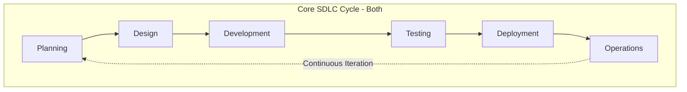
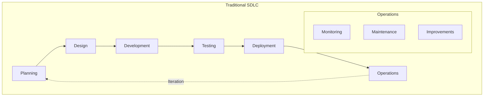
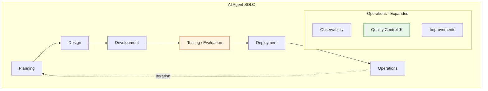
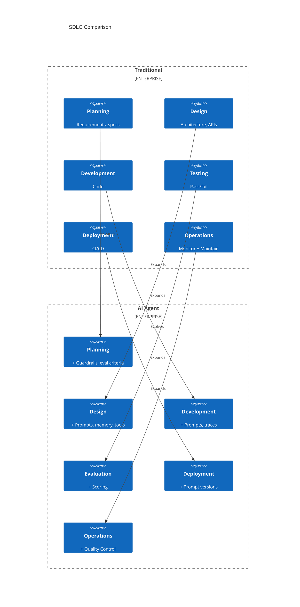

# SDLC: Traditional vs AI Agent

> Both follow the same fundamental cycle. The difference is in **what's inside each stage** and **new substages** required for non-deterministic systems.

## Document Structure

```
sdlc/
├── README.md                    # This file - overview
├── 01-traditional-sdlc.md       # Traditional SDLC stages & tools
├── 02-ai-agent-sdlc.md          # AI Agent SDLC stages & tools
├── 03-comparison.md             # Side-by-side comparison
├── 04-tools-landscape.md        # Tool ecosystem reference
└── 05-dataset-management.md     # Eval dataset management deep dive
```

## Quick Overview

Both SDLCs share the same core cycle:



### Traditional SDLC



**Artifacts**: Code
**Testing**: Pass/fail assertions
**Monitoring**: Logs, metrics, APM (Application Performance Monitoring: latency, error rates, throughput, distibuted traces, dependencies)

### AI Agent SDLC



**Artifacts**: Code + **Prompts** + **Model refs**
**Testing**: Pass/fail + **Fuzzy scoring**
**Monitoring**: Logs, metrics + **Traces** + **Token costs**

✱ = New substage

---

## What's Actually Different?

### Same Stages, Different Content

| Stage | Traditional | AI Agent | What Changes |
|-------|-------------|----------|--------------|
| **Planning** | User stories, specs | + Guardrail specs, eval criteria | Add safety boundaries |
| **Design** | Architecture, APIs | + Prompt design, memory strategy | New design artifacts |
| **Development** | Code, unit tests | + Prompt templates, tracing | New artifact types |
| **Testing** | Pass/fail assertions | + Fuzzy scoring (evals) | Scoring replaces binary |
| **Deployment** | CI/CD, feature flags | + Prompt versioning, A/B models | Version more artifacts |
| **Operations** | Monitoring, maintenance | + Quality control substage | Expanded scope |

### Genuinely New Concepts

| Concept | Why It's New |
|---------|--------------|
| **Fuzzy Evaluation** | Non-deterministic outputs need scoring, not assertions |
| **Reasoning Traces** | Debug *why* the agent decided something |
| **Quality Control** | Detect hallucinations, safety violations in real-time |
| **Prompt Versioning** | Prompts are code-level artifacts now |
| **Token Economics** | Per-request variable costs |
| **Human-in-the-loop** | Continuous feedback drives improvements |

### Key Paradigm Shift

```
Traditional: Same input → Same output (deterministic)
AI Agent:    Same input → Different outputs (probabilistic)
                         ↓
            Requires: Fuzzy evaluation, quality monitoring, traces
```

---

## Side-by-Side Diagram



---

## Summary: Evolution, Not Revolution

| Aspect | Change Type | Description |
|--------|-------------|-------------|
| Planning | **Expand** | Add guardrails and evaluation criteria |
| Design | **Expand** | Add prompt engineering and memory design |
| Development | **Expand** | Add prompt templates and tracing |
| Testing | **Evolve** | Binary → Scoring (fundamental shift) |
| Deployment | **Expand** | Version prompts alongside code |
| Operations | **Expand** | Add Quality Control substage |

The AI Agent SDLC is an **evolution** of traditional SDLC, not a replacement. Teams with strong traditional practices have a foundation—they need to **expand** existing stages and **adapt** testing for non-determinism.

---

## Reading Order

1. **[Traditional SDLC](01-traditional-sdlc.md)** - Understand the foundation
2. **[AI Agent SDLC](02-ai-agent-sdlc.md)** - See what expands/evolves
3. **[Comparison](03-comparison.md)** - Detailed stage-by-stage analysis
4. **[Tools Landscape](04-tools-landscape.md)** - Tool reference guide
5. **[Dataset Management](05-dataset-management.md)** - Eval dataset management deep dive
